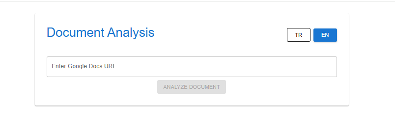
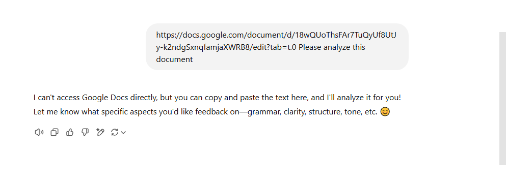

# Document Analysis Project using a Google Docs URL, Mistral AI and React JS.

## Input [the URL address](https://docs.google.com/document/d/1kcyziqwHsYq1bpj0p9DsC2PAPiyym2uXbRX0D7jTTAU/edit?tab=t.0)
## Live Link here:https://document-validator-ai.vercel.app/

## Project Goal
When you give a Google Docs URL on a LLM model, like ChatGPT, it produces output like that;

This project is developed to solve this problem. It allows users to directly input a Google Docs URL for document analysis, extracting its content, and analyzing it. The user can get an analysis by simply entering the link, without needing to copy and paste the document.

## Note
I have developed this system with the free Mistral AI model, but if you want to try it with the latest models like Claude 3.7 Sonnet, you will need sufficient credits.
